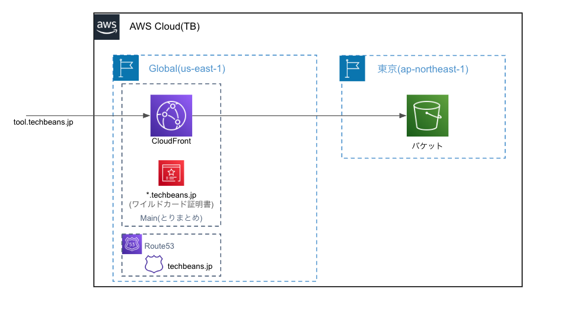

# インフラストラクチャ運用ガイド

## 概要
このディレクトリには、AWS上で動作するインフラストラクチャのTerraform設定が含まれています。
### 概要構成図


## アーキテクチャ
- **AWS S3**: 静的ウェブサイトホスティング（パブリックアクセスブロック、CloudFrontのみアクセス可能）
- **AWS CloudFront**: CDN配信（カスタムドメイン、SSL証明書、適切なキャッシュ設定）
- **AWS Route53**: DNS設定（カスタムドメイン用）
- **GitHub Actions**: 自動デプロイ（mainブランチへのpush時）
- **Next.js**: 静的エクスポート設定（S3互換）

## 前提条件
- Docker
- AWS CLI
- 適切なAWS認証情報
- GitHub リポジトリのSecrets/Variables設定

## GitHub リポジトリ設定

### 必要なSecrets
以下のSecretsをGitHubリポジトリの設定で追加してください：
- `AWS_ACCESS_KEY_ID`: AWSアクセスキー（AKIA〜形式）
- `AWS_SECRET_ACCESS_KEY`: AWSシークレットアクセスキー
- `ANTHROPIC_API_KEY`: Claude Code Action用（オプション）

### 必要なVariables
以下のVariablesをGitHubリポジトリの設定で追加してください：
- `AWS_DEFAULT_REGION`: AWSリージョン（例: ap-northeast-1）
- `S3_BUCKET_NAME`: S3バケット名
- `CLOUDFRONT_DISTRIBUTION_ID`: CloudFrontディストリビューションID

## 運用手順
すべて当ディレクトリ`infra`の中での作業です。

### .envの準備（ローカル開発用）
```bash
cp env_example .env #サンプルをコピー
nano .env #設定値を修正
```
各設定値は以下のとおりです
- AWS_REGION
  - S3バケットの配置先の指定になります。大体の場合はそのまま`ap-northeast-1`でいいはずです。
- AWS_ACCESS_KEY_ID
  - デプロイ先のAWSアカウントのAWSのアクセキー(大体は`AKIA〜`の形式)
- AWS_SECRET_ACCESS_KEY=your_secret_key
  - デプロイ先のAWSアカウントのAWSのアクセスシークレット(アクセスキーとセットで発行されているかと思います。)
### terraform.tfvarsの準備
```bash
cd terraform
cp terraform.example.tfvars terraform.tfvars #サンプルをコピー
nano terraform.tfvars #設定値を修正
```
- domain_name
  - サイトを公開するFQDN名
- acm_certificate_arn
  - アタッチするACM証明書のARN
    - `us-east-1`に置いてあるワイルドカード証明書のARNになります。
- s3_bucket_name
  - サイトのコンテンツを置くS3バケット名
- region
  - S3バケットの配置先リージョン
- route53_zone_name
  - 公開するドメイン名が属しているRoute53のホストゾーン名


### インフラストラクチャの初期化
Terraformの依存モジュールを用意するコマンドです。
```bash
docker compose run --rm terraform init
```

### インフラストラクチャの変更計画の確認
何がデプロイされるか確認できます。
```bash
docker compose run --rm terraform plan
```

### インフラストラクチャの変更の適用
`plan`時と同じようにデプロイされる物が一覧で出てきます。最後に適用するかを`Yes/No`で聞いてくるので、いいなら`yes`で続行します。
`-auto-approve`をつけるとこの確認を省略できます。
```bash
docker compose run --rm terraform apply
```

### インフラストラクチャの破棄（必要な場合）
```bash
docker compose run --rm terraform destroy
```

## 自動デプロイ
GitHub Actionsによる自動デプロイが設定されています：

### デプロイフロー
1. `main`ブランチへのpush時に自動実行
2. Next.jsアプリケーションのビルド（静的エクスポート）
3. S3バケットへの静的ファイル同期
4. CloudFrontキャッシュの無効化

### 手動デプロイ
GitHub Actionsの「Deploy」ワークフローから手動実行も可能です。

## 注意事項
- インフラストラクチャの変更は、アプリケーションのデプロイとは別のプロセスで管理されます
- 変更を適用する前に、必ず`terraform plan`で変更内容を確認してください
- 本番環境への変更は、慎重にレビューを行ってから適用してください
- GitHub SecretsとVariablesが正しく設定されていることを確認してください
- CloudFrontディストリビューションIDは、Terraformでインフラを作成後に取得できます

## トラブルシューティング
- ビルドエラーが発生する場合は、依存関係が正しくインストールされているか確認してください
- デプロイエラーが発生する場合は、AWS認証情報とS3バケット名が正しく設定されているか確認してください
- CloudFrontの更新が反映されない場合は、キャッシュの無効化が正常に実行されているか確認してください 